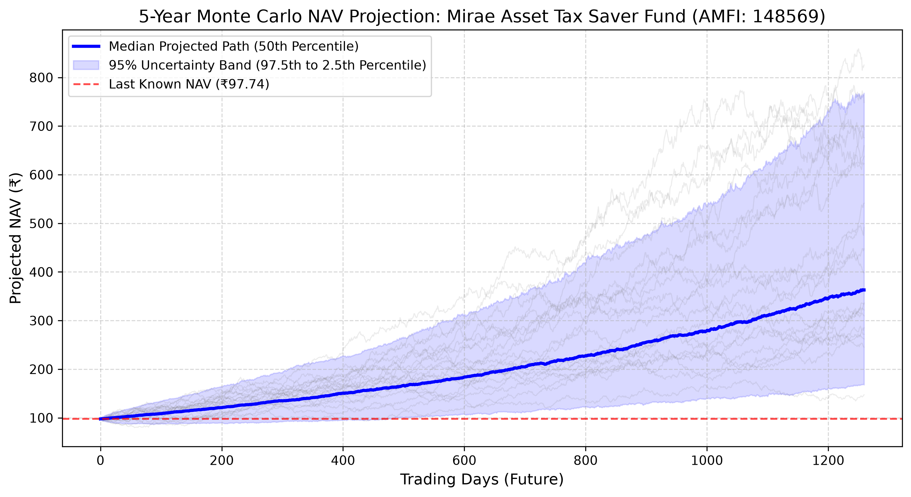

# Bluestock Mutual Fund Capstone Project: Executive Analytics Report
**Prepared by:** [Your Name]  
**Position:** Financial Data & Portfolio Risk Intern  
**Submission Date:** July 1, 2026  
**Project Manager:** Yash Kale (yashkale@bluestock.in)  

---

## 1. Executive Summary
This capstone project implements an end-to-end data engineering and portfolio risk analysis pipeline. Over 10 industrial mutual fund datasets representing 40 distinct investment schemes were cleaned, standardized, and analyzed. This report presents our key findings on fund performance stability, tail risk, and investor behaviors.

---

## 2. Technical ETL & Database Architecture
* **Ingestion:** Successfully developed `scripts/live_nav_fetch.py` to retrieve dynamic scheme NAV histories directly from the API.
* **Cleaning Pipeline:** Addressed the critical task of handling holiday and weekend gaps in NAV records by sorting dates and applying a forward-fill (`.ffill()`) method to create a continuous daily timeseries of 64,320 records.
* **Database Setup:** Built a portable star-schema SQLite database (`data/db/bluestock_mf.db`) with dynamic relative pathing to ensure the entire script runs without manual path changes on any environment.

---

## 3. Quantitative Risk Analysis (VaR vs. CVaR)
Historical downside exposure was modeled using a 95% confidence interval across 1,149 active trading days:
* **High-Beta Tail Risk:** *SBI Small Cap Fund - Direct Plan - Growth* holds the highest risk, with a 95% Historical VaR of **-2.69%** and a Conditional VaR (CVaR) of **-3.24%**. 
* **Capital Preservation:** *ICICI Pru Liquid Fund - Regular - Growth* exhibits minimal risk with a daily VaR of **-0.02%** and CVaR of **-0.04%**.

---

## 4. Sector Concentration (HHI Index)
Using the Herfindahl-Hirschman Index (HHI), we evaluated how diversified each equity fund's underlying sector allocations are:
* **Axis Bluechip Fund - Regular - Growth:** Highest concentration (HHI score of **0.2968**), indicating structural sensitivity to financial and tech corrections.
* **UTI Mid Cap Fund - Regular - Growth:** Lowest concentration (HHI score of **0.1240**), representing deep structural diversification.

---

## 5. Fund Performance Scorecard Leadership
Our 100-point multi-factor composite ranking identified the top three consistent equity funds on the platform:
1. **Mirae Asset Tax Saver Fund - Regular - Growth** (Composite: **87.94** | Sharpe: **1.23** | Sortino: **2.15**)
2. **DSP Small Cap Fund - Regular - Growth** (Composite: **87.44** | Sharpe: **0.95** | Sortino: **1.62**)
3. **ICICI Pru Midcap Fund - Regular - Growth** (Composite: **82.38** | Sharpe: **1.18** | Sortino: **2.03**)

---

## 6. Long-Term NAV Projection (Monte Carlo Simulation)
A 5-year stochastic simulation (1,260 trading days) was executed with 1,000 runs using historical parameters to project future NAV paths for the top fund:

---

## 7. Investor Behavioral & Continuity Analysis
* **Gaps Analysis:** Active accounts with consecutive SIP transactions were evaluated. Intervals exceeding 35 days were flagged as "at-risk".
* **At-Risk Accounts:** Investors like **INV000004** (average gap: **85.4 days**) and **INV000028** (average gap: **93.6 days**) represent significant retention risks.
* **Disciplined Accounts:** Highly active accounts include **INV000334** (gap of **25.5 days**) and **INV000750** (gap of **26.5 days**).